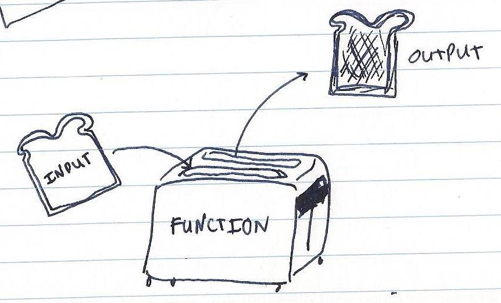

I work part-time as a teaching assistant and a lot of new programmers have a bit of trouble understand what return does.

If the textbook explanation that "functions take input values and output (or return) a value" and <a href="http://upload.wikimedia.org/wikipedia/commons/thumb/3/3b/Function_machine2.svg/440px-Function_machine2.svg.png">THE DIAGRAM</a> don't work, I like to follow up in the style of my favorite multipurpose food. Toast. And the appliances that make them. Toasters:


<figcaption>Function diagram 2.0. Hopefully more intuitive than <a href="http://upload.wikimedia.org/wikipedia/commons/thumb/3/3b/Function_machine2.svg/440px-Function_machine2.svg.png">THE DIAGRAM</a>.</figcaption>

Yup. Functions are like toasters. A toaster (function) takes a slice of bread (input), toasts your bread, and then spits out a warm piece of toast (output)! Take a look at this bit of code:

```python
def toaster(slice_of_bread):
  print('Toasting your bread...')
  print('Toasts done!')
  return 'toast'

# Run the function to get a slice of toast.
sams_toast = toaster('slice of bread')

print(sams_toast)
# prints 'toast'
```

When we put 'slice of bread' (input) into toaster(), toaster() transforms that bread into toast, and then finally spits out (or returns) that 'toast' as seen by print(sams_toast). Once the 'toast' is spit out, toaster() stops. The toaster() has done it's job so it turns off. So that means if I had a print() **after I returned 'toast', that print() would NOT run**:

```python
def toaster(slice_of_bread):
  print('Toasting your bread...')
  print('Toasts done!')
  return 'toast'
  # 'Toast more?' WILL NOT PRINT
  print('Toast more?')
```

That's what returns do. They **stop the function (so any code after in the function does not run)** and they **give us useable output**.

You can take it a step further though, since toaster() processes our input and outputs 'toast' -- **you can use that toast that we now have to put through other function**. For example, I like my toast with butter and jam:

```python
def butter_toast(toast):
  print('Spreading butter on your toast...')
  toast = 'butter ' + toast
  print('Done!')
  return toast

def spread_jam(toast):
  print('Spreading jam on your toast...')
  toast = 'jam and ' + toast
  print('Done!')
  return toast

# Run the functions.
sams_buttered_toast = butter_toast(sams_toast)
sams_buttery_jammed_out_toast = spread_jam(sams_buttered_toast)

print(sams_buttery_jammed_out_toast)
# Prints 'jam butter toast'
```

After running sams_toast through these two functions, my toast is buttered and has jam on it! All because that first toaster function output my toast! That's the beauty of returning values in functions -- **you can use the value the function outputs in different functions.**

At this point, it's crucial we look at print(). Because you might be saying isn't print() outputting a value? Not exactly, print() isn't outputting a value. It's not giving us usable toast. Instead it's **telling the human user what's going on inside of the function. The other functions butter_toast() and spread_jam() can't use print()s**. They can only use returned values, returned 'toast'. If you did want a toaster that just says 'Ready to toast!' every morning and does nothing else though, that's perfectly okay and doesn't actually need a return statement:

```python
def friendly_toaster():
  print('Ready to toast!')

friendly_toaster()
# prints 'Ready to toast!'
```

Just make sure if you're making a function that does not return anything, you're not trying to do anything with that output somewhere else.

Let's pretend for a minute the toaster() didn't output my 'toast' because it's broken and forgets to spit out 'toast'.

```python
def sad_broken_toaster(slice_of_bread):
  print('Toasting your bread...')

# Run the broken_sad_toaster function.
sams_sad_toast = sad_broken_toaster('slice of bread')

print(sams_sad_toast)
```

What does print(sams_sad_toast) print?

**NONE**

It prints NONE. Where'd the slice of bread go? Since our sad_broken_toaster() didn't return any toast, the bread has probably been burnt to a crisp. And without the prospect of toast, we'll never get the chance to butter_toast() and spread_jam() on our toast!

And if we try to put sams_sad_toast into a different function...

```python
buttered_toast_maybe = butter_toast(sams_sad_toast)
```

...we would get an error:

```python
TypeError: must be str, not NoneType
```

**Because you can't use an variable that equals None as input in a function call.** Or in terms of toast, you can't butter a slice of toast that never made it out of the toaster.

**So what did the return statement allow us to do?**

1. **Return stopped the function.**
2. **Return allowed us to use what was output in a different function.**

And there you have it! The return statement according to toast.
