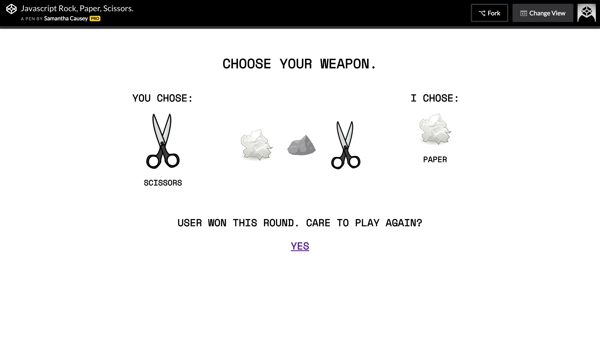

View the project on [Codepen](https://codepen.io/enigmajane/full/eGqEGX/).

I can do modules, classes, inheritance, etc. in JavaScript, but one thing I lack that I've been trying to improve upon is my ability to manipulate HTML/CSS and the web. Hence, the first of many projects, a simple HTML/CSS/JavaScript rock, paper, scissors game up on [Codepen](https://codepen.io/enigmajane/full/eGqEGX/).
