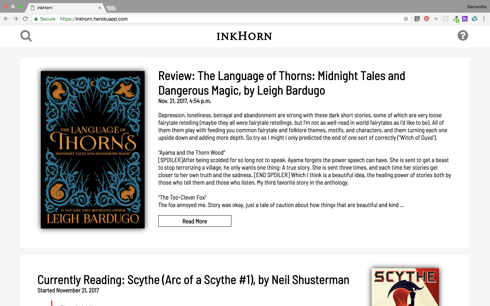
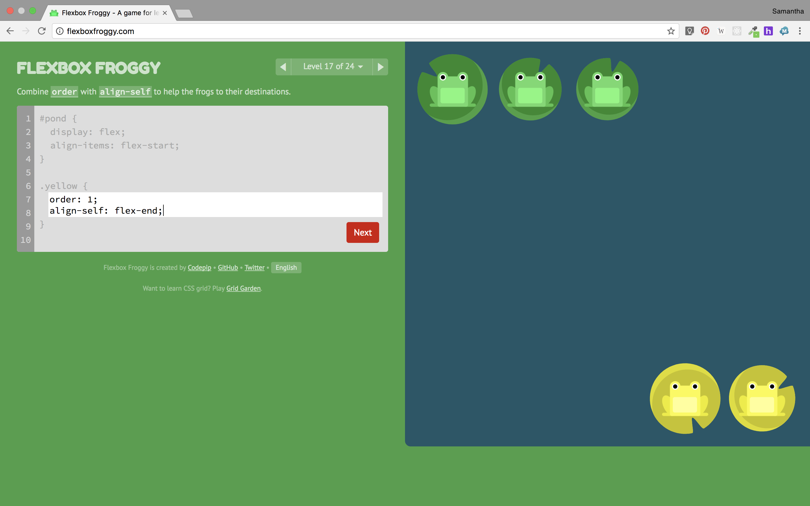

Since Python is love, Django is by default also love. So I've been going through [Crash Course Python](https://www.amazon.com/Python-Crash-Course-Hands-Project-Based/dp/1593276036) Django chapters, as well as the awesome [Django Girls](https://tutorial.djangogirls.org/en/) tutorial. I've gone through the first part of the Python Crash Course Django tutorial at least four times, and the Django Girls tutorial so many times I can't keep track of it, but I didn't really see how everything fit together until I made my own application:

I also managed to deploy it on the free tier of Heroku so you can see it live [here](https://inkhorn.herokuapp.com/). I love young adult science fiction and fantasy, and I thought it was about time to create something that would be useful to me. I'm not sure how secure it is just yet (or how secure it needs to be), but I've published it because at this point it is at least visually presentable as well as sound in the backend.

Planned updates include adding the ability to filter though books by title, customizing the admin site, preserving the HTML of review TextFields, and maybe most importantly getting static assets and user-uploaded files on AWS S3 instead of storing them on Heroku.

Right now, the HTML and CSS is a bit repetitive, but I've slowly been going through it and making it more reusable. I used this project to practice my flexbox skills.

Until a few months ago, I wasn't savvy to the flexbox game, and in order to be more helpful to the students I work with (as well as more proficient at CSS myself), I went through a few resources. Games are by far the best way to learn something like this, if you already know the basics of CSS and just want to add a bit more to your knowledge base. My favorite game so far is [Flexbox Froggy](http://flexboxfroggy.com/).

So look through the Mozilla or whatever flexbox documentation a bit, try out some games, and then look back at the documentation again. Probably makes more sense the second time. Here are other games for learning flexbox:

* [Flexbox Defense](http://www.flexboxdefense.com/)
* [Flexbox Zombies](https://geddski.teachable.com/p/flexbox-zombies)

I've just started taking a look at Flexbox Zombies (because I can't resist a decent story), and I have yet to take a look at Flexbox Defense.

I keep a note of project ideas I have and one of them was building a game that explains recursion to new programmers. It's a hard concept to explain in person, so it's even harder to explain through messages, so it would be something I could send to people I'm teaching in hopes of helping. It's on my list.
